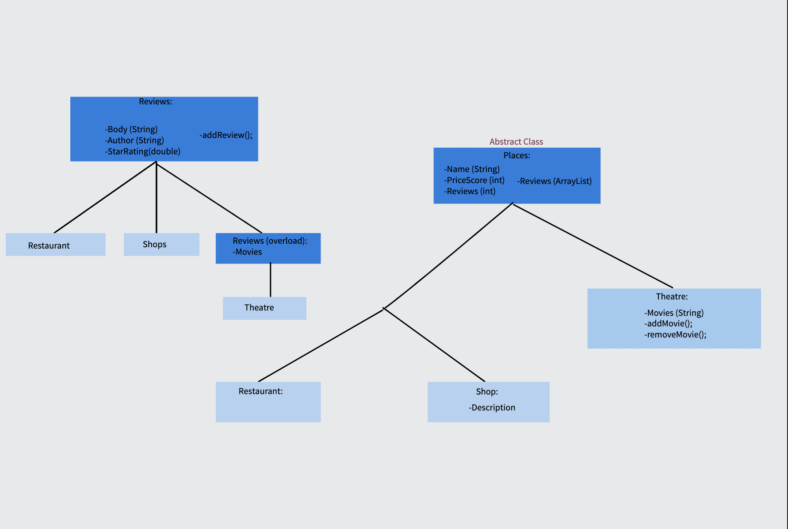

# Inheritance 

## The inheritance package contains a restaurant class and review class that can be used together to create Restaurant objects and Review objects.

### The star review system in place has a range of 0 to 5 stars (0 being the worst and 5 the best)
### There is also a price score that is in the range of 0 to 3 (inexpensive to expensive)

### Testing:
- The classes in the restaurant and review packages have corresponding tests files and individual tests for the methods of the classes.
- run ./gradlew test from the inheritance directory
